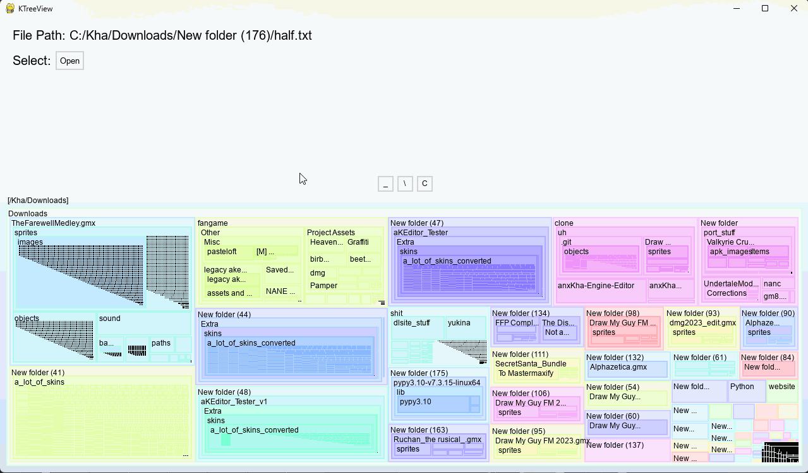

# KTreeView
Tool to visualize hierarchical information using squarified treemaps

**Usage**: Download the latest release, unzip it, and run KTreeView.exe

**Input**: A plaintext file containing hierarchies. Each line should start with a '/', such as '/a/b/c'

